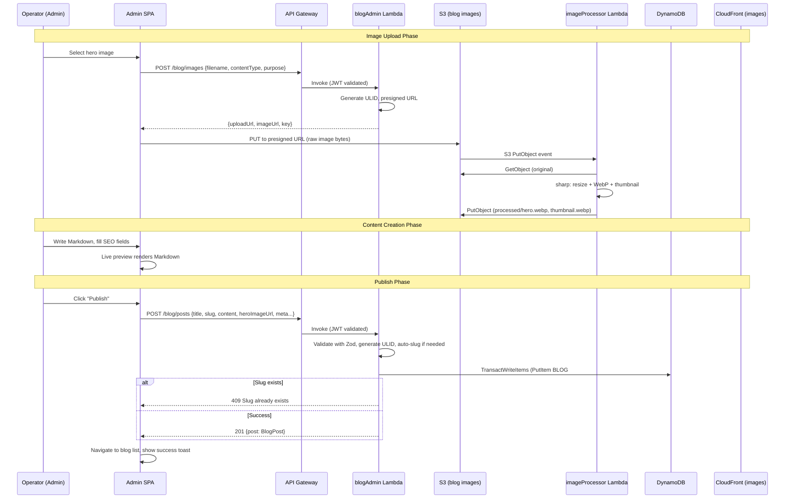
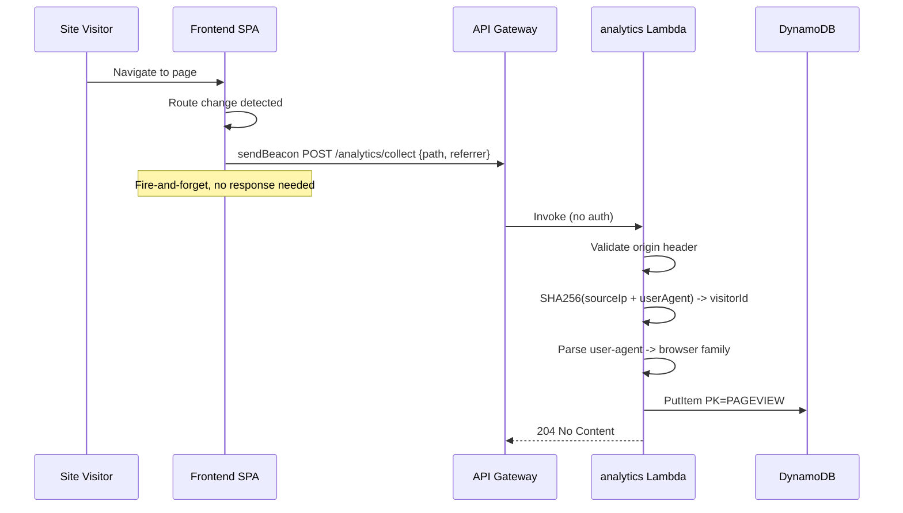
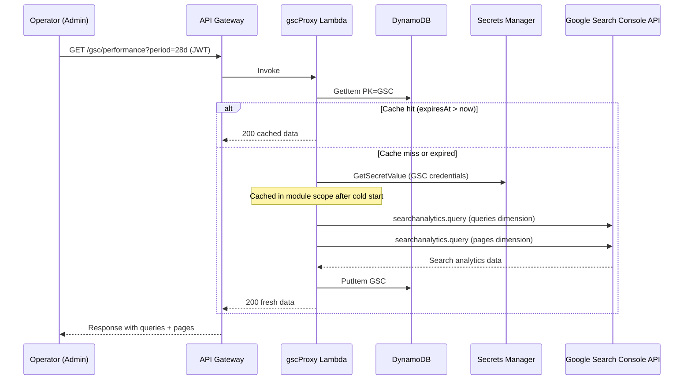
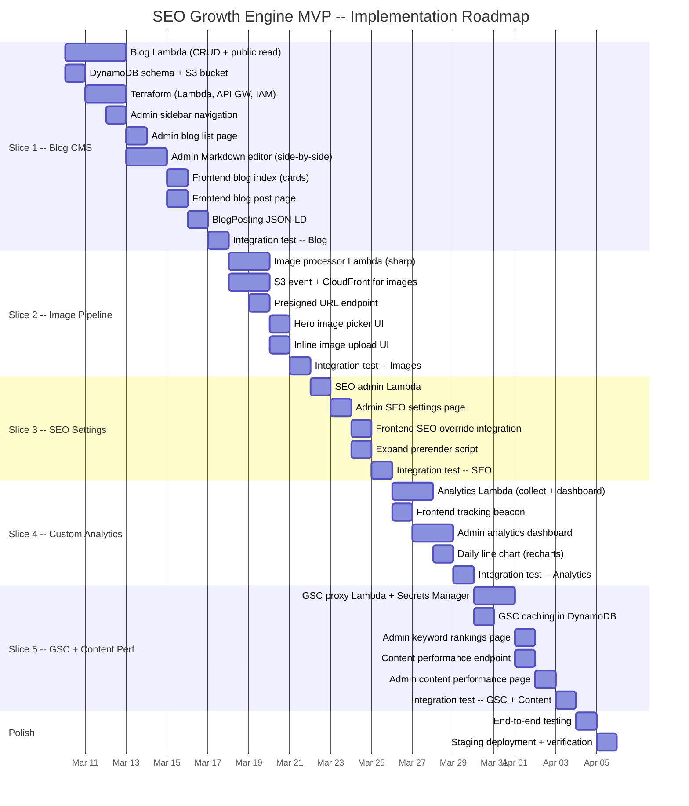

# SEO Growth Engine -- Architecture Diagram, Milestones, and Product Roadmap

## 1. System Architecture Diagram

```mermaid
graph TB
    subgraph "Internet"
        Visitor["Site Visitor<br/>(tropicoretreat.com)"]
        Operator["Operator Browser<br/>(admin.tropicoretreat.com)"]
        GSC_API["Google Search Console<br/>API"]
    end

    subgraph "AWS -- us-east-1"
        subgraph "Content Delivery"
            CF_MAIN["CloudFront<br/>tropicoretreat.com<br/>(frontend SPA)"]
            CF_ADMIN["CloudFront<br/>admin.tropicoretreat.com<br/>(admin SPA)"]
            CF_IMAGES["CloudFront<br/>images.tropicoretreat.com<br/>(blog images)"]
        end

        subgraph "API Layer"
            APIGW["API Gateway v2<br/>api.tropicoretreat.com/v1"]
            COGNITO["Cognito User Pool<br/>(JWT Authorizer)"]
        end

        subgraph "Blog Pipeline"
            LAMBDA_BLOG["Lambda: tropico-blog-admin<br/>Blog CRUD + Image Presign<br/>+ Public Read"]
            S3_UPLOADS["S3: tropico-blog-images<br/>/uploads/*"]
            LAMBDA_IMG["Lambda: tropico-image-processor<br/>sharp: resize + WebP + thumbnail"]
            S3_PROCESSED["S3: tropico-blog-images<br/>/processed/*"]
        end

        subgraph "SEO Settings"
            LAMBDA_SEO["Lambda: tropico-seo-admin<br/>SEO Overrides CRUD"]
        end

        subgraph "Analytics Pipeline"
            LAMBDA_ANALYTICS["Lambda: tropico-analytics<br/>Beacon Collect + Dashboard"]
        end

        subgraph "GSC Integration"
            LAMBDA_GSC["Lambda: tropico-gsc<br/>GSC Proxy + Content Perf"]
            SECRETS["Secrets Manager<br/>GSC Service Account Key"]
        end

        subgraph "Storage"
            DDB["DynamoDB<br/>tropico-leads-{env}<br/>(single-table design)"]
        end

        subgraph "Existing Infrastructure"
            LAMBDA_LEADS["Lambda: tropico-leads-admin<br/>(existing CRM)"]
            LAMBDA_EMAIL["Lambda: tropico-email-admin<br/>(existing Email CRM)"]
        end
    end

    %% Visitor flows
    Visitor -->|"Browse site"| CF_MAIN
    CF_MAIN -->|"sendBeacon"| APIGW
    Visitor -->|"Read blog"| CF_MAIN
    CF_MAIN -->|"GET /blog/posts"| APIGW
    CF_IMAGES -->|"Serve images"| S3_PROCESSED

    %% Analytics flow
    APIGW -->|"POST /analytics/collect"| LAMBDA_ANALYTICS
    LAMBDA_ANALYTICS -->|"Write page view"| DDB

    %% Blog public read
    APIGW -->|"GET /blog/posts/{slug}"| LAMBDA_BLOG
    LAMBDA_BLOG -->|"Read post"| DDB

    %% Operator flows
    Operator -->|"Admin dashboard"| CF_ADMIN
    CF_ADMIN -->|"API calls + JWT"| APIGW
    APIGW -->|"Authorize"| COGNITO

    %% Blog admin
    APIGW -->|"POST/PUT/DELETE /blog/*"| LAMBDA_BLOG
    LAMBDA_BLOG -->|"CRUD posts"| DDB
    LAMBDA_BLOG -->|"Presigned URL"| S3_UPLOADS
    Operator -->|"Direct upload"| S3_UPLOADS
    S3_UPLOADS -->|"S3 Event"| LAMBDA_IMG
    LAMBDA_IMG -->|"Read original"| S3_UPLOADS
    LAMBDA_IMG -->|"Write processed"| S3_PROCESSED

    %% SEO
    APIGW -->|"GET/PUT /seo/*"| LAMBDA_SEO
    LAMBDA_SEO -->|"CRUD overrides"| DDB

    %% Analytics dashboard
    APIGW -->|"GET /analytics/dashboard"| LAMBDA_ANALYTICS

    %% GSC
    APIGW -->|"GET /gsc/*"| LAMBDA_GSC
    LAMBDA_GSC -->|"Read/write cache"| DDB
    LAMBDA_GSC -->|"Read credentials"| SECRETS
    LAMBDA_GSC -->|"searchanalytics.query"| GSC_API

    %% Existing
    APIGW -->|"existing routes"| LAMBDA_LEADS
    APIGW -->|"existing routes"| LAMBDA_EMAIL
    LAMBDA_LEADS -->|"CRUD leads"| DDB
    LAMBDA_EMAIL -->|"CRUD emails"| DDB

    classDef new fill:#e8f5e9,stroke:#2e7d32,stroke-width:2px
    classDef existing fill:#f3f4f6,stroke:#6b7280,stroke-width:1px
    classDef cdn fill:#e3f2fd,stroke:#1565c0,stroke-width:1px
    classDef storage fill:#fff3e0,stroke:#ef6c00,stroke-width:1px

    class LAMBDA_BLOG,LAMBDA_SEO,LAMBDA_ANALYTICS,LAMBDA_GSC,LAMBDA_IMG new
    class LAMBDA_LEADS,LAMBDA_EMAIL,COGNITO existing
    class CF_MAIN,CF_ADMIN,CF_IMAGES cdn
    class DDB,S3_UPLOADS,S3_PROCESSED,SECRETS storage
```



## 2. Data Flow Diagrams

### 2.1 Blog Publish Flow



### 2.2 Analytics Collection Flow



### 2.3 GSC Performance Flow



## 3. DynamoDB Entity Diagram

```mermaid
erDiagram
    BLOG_POST {
        string PK "BLOG#{id}"
        string SK "BLOG#{id}"
        string GSI1PK "BLOG#PUBLISHED"
        string GSI1SK "publishedAt"
        string id "ULID"
        string title
        string slug
        string content "Markdown"
        string excerpt "auto ~200 chars"
        string heroImageUrl
        string metaTitle
        string metaDescription
        string ogImageUrl
        string authorName
        string authorOrg "Tropico Retreats"
        string status "published"
        string publishedAt
    }

    SLUG_INDEX {
        string PK "SLUG#{slug}"
        string SK "SLUG#{slug}"
        string slug
        string blogId "ULID"
    }

    SEO_OVERRIDE {
        string PK "SEO#{path}"
        string SK "SEO#{path}"
        string GSI1PK "SEO#ALL"
        string GSI1SK "path"
        string path
        string metaTitle
        string metaDescription
        string ogTitle
        string ogDescription
        string ogImageUrl
        string keywords
        string updatedBy
    }

    PAGE_VIEW {
        string PK "PAGEVIEW#{date}"
        string SK "PAGEVIEW#{ts}#{ulid}"
        string path
        string referrer
        string visitorId "SHA256 hash"
        string userAgent "browser family"
        string country
    }

    GSC_CACHE {
        string PK "GSC#CACHE"
        string SK "GSC#{type}#{range}"
        string data "JSON"
        string fetchedAt
        string expiresAt
    }

    BLOG_POST ||--|| SLUG_INDEX : "unique slug"
    BLOG_POST ||--o| SEO_OVERRIDE : "optional override"
```

## 4. Milestone Table

| # | Milestone | Scope | Deliverables | Est. Duration | Dependencies |
|---|---|---|---|---|---|
| M1 | Blog CMS Backend | Backend + Infra | blogAdmin Lambda (CRUD + public read), DynamoDB blog/slug schema, S3 bucket, API Gateway routes, IAM, Terraform | 2-3 days | None |
| M2 | Blog CMS Admin UI | Admin Frontend | Blog list page, Markdown editor (side-by-side), blog form (title, slug, meta), TanStack Query hooks, sidebar navigation | 2-3 days | M1 |
| M3 | Blog Public Frontend | Frontend | Blog index page (cards), blog post page (Markdown render), routes, structured data (BlogPosting JSON-LD) | 1-2 days | M1 |
| M4 | Image Pipeline | Backend + Infra | imageProcessor Lambda, S3 event trigger, presigned URL endpoint, sharp processing (resize, WebP, thumbnail), CloudFront for images | 2-3 days | M1 |
| M5 | Image Upload UI | Admin Frontend | Hero image file picker, inline image upload, image URL insertion into Markdown, upload progress | 1 day | M4 |
| M6 | SEO Settings Backend | Backend + Infra | seoAdmin Lambda (list + upsert), DynamoDB SEO override schema, API Gateway routes | 1-2 days | None |
| M7 | SEO Settings Admin UI | Admin Frontend | SEO settings page (all pages listed), edit form (meta title, description, OG tags), page selector | 1 day | M6 |
| M8 | SEO Frontend Integration | Frontend | Fetch SEO overrides for current page, apply to react-helmet-async, expand prerender script for blogs + overrides | 1-2 days | M3, M6 |
| M9 | Analytics Backend | Backend + Infra | analytics Lambda (collect + dashboard), DynamoDB pageview schema, API Gateway routes, bot filtering | 1-2 days | None |
| M10 | Analytics Beacon | Frontend | Tracking script, sendBeacon on page load + route change, origin validation | 0.5 day | M9 |
| M11 | Analytics Dashboard UI | Admin Frontend | Traffic dashboard page, summary cards, top pages table, top referrers table, daily line chart (recharts) | 1-2 days | M9 |
| M12 | GSC Backend | Backend + Infra | gscProxy Lambda, Secrets Manager for credentials, DynamoDB cache schema, googleapis integration, API Gateway routes | 2-3 days | None |
| M13 | GSC Dashboard UI | Admin Frontend | Keyword rankings page (queries table, pages table), period selector, cache indicator | 1 day | M12 |
| M14 | Content Performance | Backend + Admin | Content performance endpoint (joins blog + analytics + GSC), content performance page, unified table | 1-2 days | M3, M9, M12 |

**Total estimated duration: 16-24 days**

## 5. Vertical Slices (Implementation Order)

Each slice delivers testable, end-to-end user value.

### Slice 1: "An operator can publish a blog post and a visitor can read it"
**Scope:** M1 + M2 + M3 (backend + admin + frontend)
- Deploy blogAdmin Lambda with CRUD routes and public read routes
- Deploy DynamoDB blog post + slug index schema
- Deploy S3 bucket for blog images (placeholder, no processing yet)
- Deploy API Gateway routes (public + admin)
- Build admin blog list page + Markdown editor (side-by-side preview)
- Build frontend blog index page (cards) + blog post page (Markdown render)
- Add blog routes to frontend + admin
- Add BlogPosting JSON-LD structured data
- Verify: create post in admin, see it on public frontend at /blog/{slug}

### Slice 2: "An operator can upload images that are auto-optimized"
**Scope:** M4 + M5 (backend + infra + admin)
- Deploy imageProcessor Lambda with sharp (resize, WebP, thumbnail)
- Deploy S3 event notification (uploads/ prefix -> Lambda)
- Deploy CloudFront distribution for blog images
- Deploy presigned URL endpoint in blogAdmin Lambda
- Build hero image file picker in blog editor
- Build inline image upload UI with URL copy
- Verify: upload image, see processed WebP served via CloudFront

### Slice 3: "An operator can edit SEO meta for any page, and it renders correctly"
**Scope:** M6 + M7 + M8 (backend + admin + frontend)
- Deploy seoAdmin Lambda with list + upsert routes
- Deploy DynamoDB SEO override schema
- Build admin SEO settings page with page selector + edit form
- Extend frontend SEO component to check for overrides
- Expand prerender script to fetch blog posts + SEO overrides
- Verify: edit meta for /about in admin, see updated meta in prerendered HTML

### Slice 4: "An operator can view traffic analytics for the site"
**Scope:** M9 + M10 + M11 (backend + frontend + admin)
- Deploy analytics Lambda with collect + dashboard endpoints
- Deploy DynamoDB pageview schema
- Build frontend analytics beacon (sendBeacon on page load + route change)
- Build admin analytics dashboard (summary cards, top pages, referrers, daily chart)
- Verify: visit pages on frontend, see views appear in admin dashboard

### Slice 5: "An operator can view keyword rankings and content performance"
**Scope:** M12 + M13 + M14 (backend + admin)
- Deploy gscProxy Lambda with GSC API integration
- Deploy Secrets Manager for GSC credentials
- Deploy DynamoDB GSC cache schema
- Build admin keyword rankings page (queries, pages, period selector)
- Build content performance endpoint (joins blog + analytics + GSC)
- Build admin content performance page (unified table)
- Verify: see GSC data in admin, see combined content metrics

## 6. Product Roadmap



## 7. Risk Register

| Risk | Likelihood | Impact | Mitigation |
|---|---|---|---|
| sharp Lambda bundle size (native binary) | Medium | Medium -- may need Lambda layer | Use sharp's prebuilt Linux ARM64 binary. If bundle exceeds Lambda limits, create a Lambda layer for sharp |
| GSC service account setup complexity | Low | Medium -- blocks Slice 5 | Document exact steps. Can be done in parallel with earlier slices |
| GSC API returns empty data for new property | Medium | Low -- expected for new properties | Show "No data yet" state. GSC takes weeks to accumulate meaningful data |
| Analytics DynamoDB cost at scale (many writes) | Low | Medium -- cost increase | PAY_PER_REQUEST billing handles spikes. If sustained high traffic, add daily aggregation Lambda (deferred) |
| Prerender script timeout with many blog posts | Low | Low -- build time increase | Prerender in batches. At MVP scale (<50 posts), not an issue |
| Markdown rendering XSS via injected HTML | Low | High -- security breach | Use react-markdown with disallowed raw HTML. Server-side content validation |
| Blog image upload fails silently (S3 event not triggering Lambda) | Low | Medium -- broken images | CloudWatch alarm on image processor errors. Admin UI shows processing status |
| Slug collision on concurrent creates | Very Low | Low -- 409 error | TransactWriteItems with conditional PutItem on slug index is atomic |

## 8. Success Criteria

| Criteria | Measurement | Target |
|---|---|---|
| Operator can publish blog post without developer | End-to-end test | Post visible at /blog/{slug} within 5 seconds |
| Blog posts are prerendered for SEO | Build output check | HTML files exist for each blog post after prerender |
| BlogPosting structured data is valid | Google Rich Results Test | Passes validation with no errors |
| Images auto-optimized to WebP | S3 check after upload | Processed WebP exists within 10 seconds of upload |
| Analytics beacon fires on page load | Network tab inspection | POST to /analytics/collect on every navigation |
| Analytics dashboard shows real data | Manual test | Page views visible after browsing site |
| GSC data displays in admin | Manual test | Keyword rankings visible with correct period |
| SEO overrides apply to frontend | View source check | Custom meta title visible in page source |
| Content performance joins data correctly | Manual test | Blog post shows both traffic and GSC metrics |
| No PII in analytics data | DynamoDB check | No raw IPs, no full user-agent strings stored |
