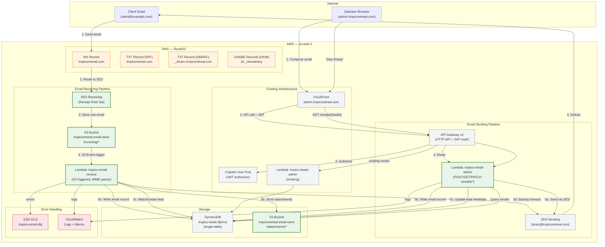
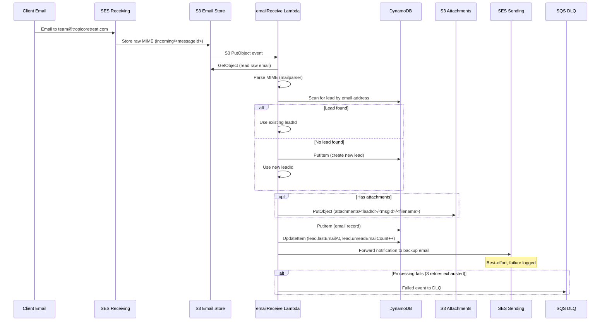
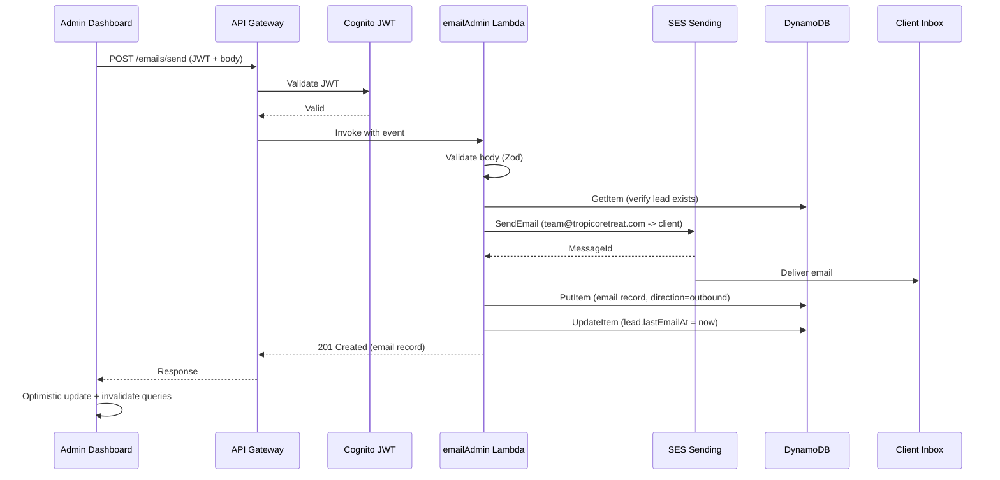
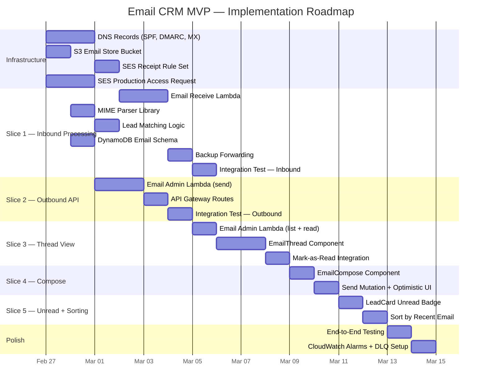

# Email CRM — Architecture Diagram, Milestones, and Product Roadmap

## 1. System Architecture Diagram



## 2. Data Flow Diagram — Inbound Email



## 3. Data Flow Diagram — Outbound Email



## 4. DynamoDB Entity Diagram

```mermaid
erDiagram
    LEAD {
        string PK "LEAD#{id}"
        string SK "LEAD#{id}"
        string GSI1PK "STATUS#{status}"
        string GSI1SK "createdAt"
        string id "ULID"
        string status "NEW|CONTACTED|QUOTED|WON|LOST|ARCHIVED"
        string temperature "HOT|WARM|COLD"
        string firstName
        string lastName
        string email
        string lastEmailAt "ISO 8601 (new)"
        number unreadEmailCount "(new)"
    }

    NOTE {
        string PK "LEAD#{leadId}"
        string SK "NOTE#{timestamp}#{noteId}"
        string id "ULID"
        string leadId
        string content
        string authorId
        string authorName
        string type "MANUAL|SYSTEM"
    }

    EMAIL {
        string PK "LEAD#{leadId}"
        string SK "EMAIL#{timestamp}#{messageId}"
        string id "messageId or ULID"
        string leadId
        string direction "inbound|outbound"
        string fromAddress
        string toAddress
        string subject
        string bodyText
        string bodyHtml
        string sentAt "ISO 8601"
        string readAt "ISO 8601 or null"
        string operator "outbound only"
        string s3Key "inbound raw email"
    }

    LEAD ||--o{ NOTE : "has notes"
    LEAD ||--o{ EMAIL : "has emails"
```

## 5. Milestone Table

| # | Milestone | Scope | Deliverables | Est. Duration | Dependencies |
|---|---|---|---|---|---|
| M1 | DNS + SES Receiving Setup | Infra | SPF, DMARC, MX records; SES receipt rule set; S3 email bucket; SES production access request | 1-2 days (DNS propagation) | None |
| M2 | Inbound Email Processing | Backend + Infra | emailReceive Lambda; MIME parsing; lead matching; email DynamoDB writes; S3 attachment storage; backup forwarding; DLQ; IAM roles | 2-3 days | M1 |
| M3 | Outbound Email API | Backend + Infra | emailAdmin Lambda (send route); Zod validation; SES send; email DynamoDB writes; API Gateway route; IAM policies | 1-2 days | M1 |
| M4 | Email Thread API | Backend + Infra | emailAdmin Lambda (list route, mark-read route); pagination; API Gateway routes | 1 day | M2, M3 |
| M5 | Email Thread UI | Frontend | EmailThread component; EmailBubble component; email hooks; lead detail integration; mark-as-read on view | 2 days | M4 |
| M6 | Email Compose UI | Frontend | EmailCompose component; send mutation; optimistic updates; auto-subject for replies | 1 day | M4 |
| M7 | Unread Indicators + Sorting | Frontend + Backend | Unread badge on LeadCard; sort by lastEmailAt; last email preview; lead type extensions | 1 day | M4 |
| M8 | Integration Testing + Polish | All | End-to-end send/receive test; error handling verification; DLQ monitoring setup; CloudWatch alarms | 1-2 days | M5, M6, M7 |

**Total estimated duration: 10-14 days**

## 6. Vertical Slices (Implementation Order)

Each slice delivers testable, end-to-end user value:

### Slice 1: "An inbound email is stored and visible in DynamoDB"
**Scope:** M1 + M2 (infra + backend only)
- Deploy DNS records (SPF, DMARC, MX)
- Create S3 bucket with lifecycle rules
- Deploy SES receipt rule
- Deploy emailReceive Lambda with MIME parsing
- Deploy IAM roles
- Verify: send test email, check DynamoDB record exists

### Slice 2: "An operator can send an email from the API"
**Scope:** M3 (backend only)
- Deploy emailAdmin Lambda (send route)
- Deploy API Gateway route
- Deploy IAM policies
- Verify: curl POST /emails/send, check email delivered + DynamoDB record

### Slice 3: "An operator can view the email thread in the dashboard"
**Scope:** M4 + M5 (backend + frontend)
- Deploy emailAdmin Lambda (list + mark-read routes)
- Deploy API Gateway routes
- Build EmailThread, EmailBubble components
- Build email hooks (useEmailThread, useMarkEmailsRead)
- Integrate into LeadDetail page
- Verify: navigate to lead, see email thread, inbound/outbound aligned correctly

### Slice 4: "An operator can compose and send an email from the dashboard"
**Scope:** M6 (frontend)
- Build EmailCompose component
- Build useSendEmail mutation hook
- Integrate into LeadDetail page below thread
- Verify: type email, click send, see it appear in thread

### Slice 5: "An operator sees unread badges and can sort leads by email activity"
**Scope:** M7 (frontend + backend)
- Extend LeadCard with unread badge
- Extend Lead type with lastEmailAt, unreadEmailCount
- Add sort-by-recency option
- Add last email preview on card
- Verify: receive email, see badge on lead card, sort works

## 7. Product Roadmap



## 8. Risk Register

| Risk | Likelihood | Impact | Mitigation |
|---|---|---|---|
| SES sandbox removal delayed (>24h) | Medium | High — cannot send to unverified recipients | Request early; test with verified addresses; provide clear instructions to operations |
| MX record propagation delay | Low | Medium — inbound emails delayed up to 48h | Deploy DNS first; verify with `dig MX tropicoretreat.com` before proceeding |
| MIME parsing edge cases (encoding, attachments) | Medium | Medium — some emails may not parse correctly | Use battle-tested `mailparser` library; store raw email in S3 as fallback; add error flag on records |
| DynamoDB item size limit (400KB) | Low | Medium — very large email bodies may exceed limit | Truncate body at 100KB; store full body in S3 if needed; add `bodyTruncated` flag |
| Email loop (auto-reply sends to team address) | Low | High — infinite email loop | emailReceive Lambda checks `fromAddress !== team@tropicoretreat.com`; rate limit on SES receipt rule |
| Existing TXT record collision (SPF + Google verify) | Low | Low — Terraform may error on multiple TXT records | Combine into single TXT record resource with multiple values |
| Lead matching returns multiple leads for same email | Low | Medium — ambiguous matching | Take most recently created lead; log warning for manual review |

## 9. Success Criteria

| Criteria | Measurement | Target |
|---|---|---|
| Operator can send email from dashboard | End-to-end test | Email received by test inbox within 10 seconds |
| Inbound email appears in dashboard | End-to-end test | Email visible in thread within 30 seconds of sending |
| Unknown sender creates new lead | End-to-end test | New lead appears in lead list after email from unknown address |
| Unread badges show correctly | Manual test | Badge appears when inbound email received; disappears when thread viewed |
| Backup forwarding works | End-to-end test | Personal email receives forwarded copy within 60 seconds |
| No email content in logs | Log audit | Grep CloudWatch logs for email body content returns zero results |
| SPF/DKIM/DMARC pass | External tool (mail-tester.com) | Score 10/10 on email authentication |
